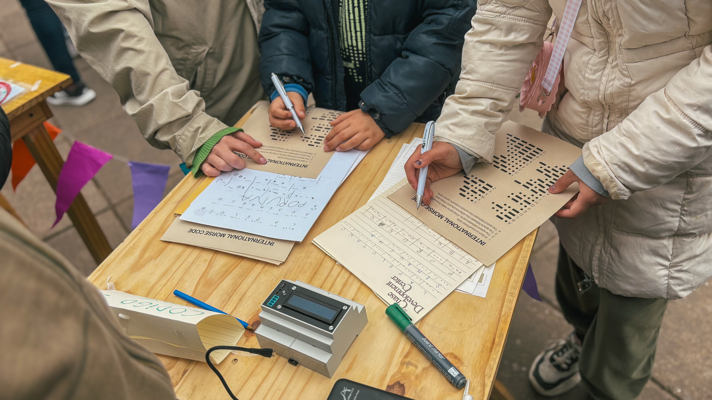

# Description

This project is a toy for those interested in learning how morse code works. It has an led that blinks following the morse code protocol and a display that shows which character is currently being transmitted. The objective is to decode the phrase being transmitted (ideally not looking at the display).

## Hardware

This project uses a discontinued esp32-s3 based development board, a blue led and a lcd display of 2 rows and 16 columns with an i2c backpack. I wired two of the mounting screws of the display to unused gpios of the microcontroller so that they can be used as buttons, by configuring them as capacitive inputs.

## Software

I programmed this project in circuitpython.

The code is pretty simple, in the codeled file is a class that contains a dictionary that matches each letter with it's respective morse code representation. Then it has a function called tx which can be passed two parameters, a string that contains the message to transmit and a reference time which is the dot representation time (all other times are multiples of this one).

Then on the code.py file the main function picks a phrase from the txt file, and starts reproducing it. The phrase then can be showed, and the game restarted using the buttons.

## Demo (the kids and their parents enjoyed it):

## Contributing

Pull requests are welcome. For major changes, please open an issue first
to discuss what you would like to change.
